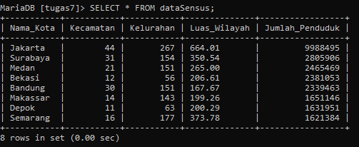
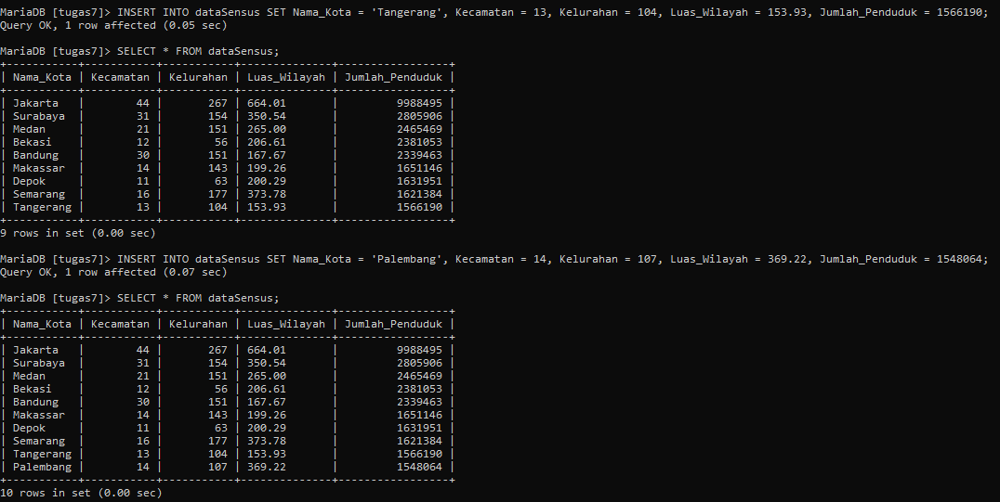
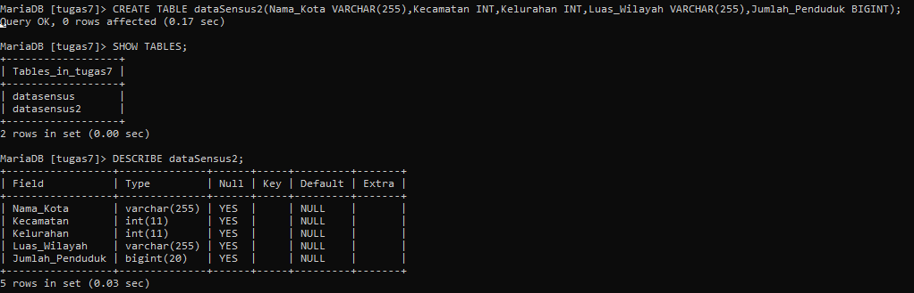
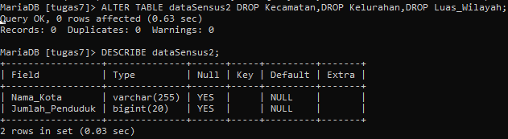
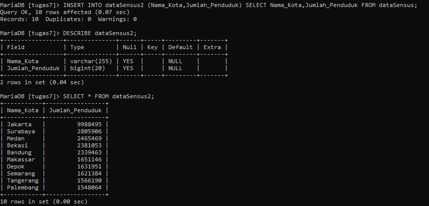

# Tugas_7_MySQL

|Nama Kota  | Kecamatan    | Kelurahan   | Luas Wilayah (km^2)     | Jumlah Penduduk  |
|-----------|:------------:|:-----------:|:-----------------------:|:---------------- |
| Jakarta   |  44          | 267         | 664,01                  | 9.988.495        |
| Surabaya  |  31          | 154         | 350,54                  | 2.805.906        |
| Medan     |  21          | 151         | 265,00                  | 2.465.469        |
| Bekasi    |  12          | 56          | 206,61                  | 2.381.053        |
| Bandung   |  30          | 151         | 167,67                  | 2.339.463        |
| Makassar  |  14          | 143         | 199,26                  | 1.651.146        |
| Depok     |  11          | 63          | 200,29                  | 1.631.951        |
| Semarang  |  16          | 177         | 373,78                  | 1.621.384        |
| Tangerang |  13          | 104         | 153,93                  | 1.566.190        |
| Palembang |  14          | 107         | 369,22                  | 1.548.064        |

### 1. Buatlah struktur tabel yang akan menampung data-data diatas (CREATE TABLE). Kali ini saya tidak akan membatasi nama tabel, nama kolom maupun tipe datanya. Silahkan teman-teman **berkreasi** sendiri.
```mysql
CREATE TABLE dataSensus(
	Nama_Kota VARCHAR(255),
	Kecamatan INT,
	Kelurahan INT,
	Luas_Wilayah VARCHAR(255),
	Jumlah_Penduduk BIGINT
);
```

### 2. Input 8 kota pertama menggunakan query INSERT ... VALUES, bisa menginputnya satu per satu (satu query INSERT untuk setiap baris), atau sekaligus dalam satu query INSERT.
```mysql
INSERT INTO dataSensus (Nama_Kota, Kecamatan, Kelurahan, Luas_Wilayah, Jumlah_Penduduk) VALUES
('Jakarta', 44, 267,664.01,9988495),
('Surabaya', 31, 154,350.54,2805906),
('Medan', 21, 151,265.00,2465469),
('Bekasi', 12, 56,206.61,2381053),
('Bandung', 30, 151,167.67,2339463),
('Makassar', 14, 143,199.26,1651146),
('Depok', 11, 63,200.29,1631951),
('Semarang', 16, 177,373.78,1621384)
```



### 3. Input 2 kota terakhir menggunakan query INSERT ... SET.
```mysql
INSERT INTO dataSensus SET Nama_Kota = 'Tangerang', Kecamatan = 13, Kelurahan = 104, Luas_Wilayah = 153.93, Jumlah_Penduduk = 1566190;
```

```mysql
INSERT INTO dataSensus SET Nama_Kota = 'Palembang', Kecamatan = 14, Kelurahan = 107, Luas_Wilayah = 369.22, Jumlah_Penduduk = 1548064;
```



### 4. Buat tabel kedua dengan menggunakan struktur yang sama dengan tabel pertama. Artinya, akan ada 2 tabel: Tabel pertama yang sudah berisi data (yang kita buat berdasarkan soal 1 - 3), dan tabel kedua yang belum berisi data. Struktur tabel pertama dan kedua ini sama persis, dimana sama-sama terdiri dari 5 kolom.
```mysql
CREATE TABLE dataSensus2(Nama_Kota VARCHAR(255),Kecamatan INT,Kelurahan INT,Luas_Wilayah VARCHAR(255),Jumlah_Penduduk BIGINT);
```



### 5. Ubah tabel kedua, hapus kolom Kecamatan, Kelurahan dan Luas Wilayah. Sehingga tabel kedua hanya berisi 2 kolom saja: Nama Kota dan Jumlah Penduduk.
```mysql
ALTER TABLE dataSensus2
DROP Kecamatan,DROP Kelurahan,DROP Luas_Wilayah;
```



### 6. Input tabel kedua dengan data yang diambil dari tabel pertama. Disini gunakan query INSERT ... SELECT. Perhatikan bahwa jumlah kolom di tabel kedua hanya tinggal 2 buah: Nama Kota dan Jumlah Penduduk. Struktur kolom ini sudah tidak sama dengan jumlah kolom dari tabel pertama. Hasil akhirnya dari query INSERT ... SELECT, tabel kedua akan berisi 10 nama kota beserta jumlah penduduk, seperti tampilan berikut:


```mysql
INSERT INTO dataSensus2 (Nama_Kota,Jumlah_Penduduk) SELECT Nama_Kota,Jumlah_Penduduk FROM dataSensus;
```


